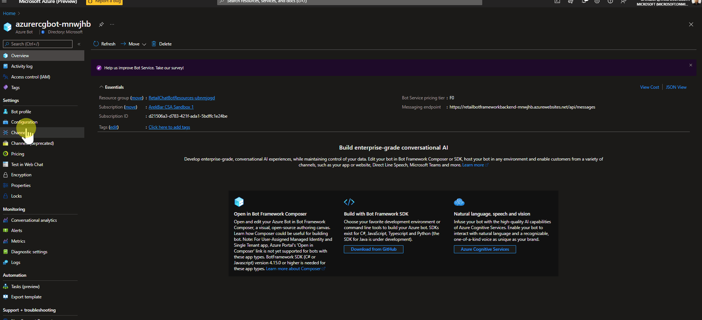

<!-- ABOUT THE PROJECT -->
# About This Module

The purpose of this module is to add voice capability to the deployed bot

# Create Speech Resource

```shell
az cognitiveservices account create --name speech-for-retail-bot --resource-group RetailChatBotResources-YourPostfix --kind SpeechServices --sku S0 --location westus 
```

# Add Speech 

Unfortinately currently there is no CLI command to add a direct line voice channel via CLI

To do this thrtough the portal navigate to the deployed Azure bot and add the channel.

Azure Bot > Channels > Direct Line Speech > Select speech-for-retail-bot from the dropdown > Save

<br />
<div align="left">
  <a href="../../ReadmeContent/BotVoiceChannelAdd.gif">
    
  </a>
</div>

# Test Speech 

Go to the [Github Repository](https://github.com/Azure-Samples/Cognitive-Services-Voice-Assistant/blob/master/clients/csharp-wpf/README.md) for the Windows Voice Assistant Client.

Follow the provided instructions to either:

* Download a prebuilt executable file in a .zip package to run
* Build the executable file yourself, by cloning the repository and building the project
* Open the VoiceAssistantClient.exe client application and configure it to connect to your bot, by following the instructions in the GitHub repository.

* Select Reconnect and make sure you see the message "New conversation started - type or press the microphone button."

Let's test it out. Select the microphone button, and speak a few words in English. The recognized text appears as you speak. When you're done speaking, the bot replies in its own voice, saying "echo" followed by the recognized words.

You can also use text to communicate with the bot. Just type in the text on the bottom bar.