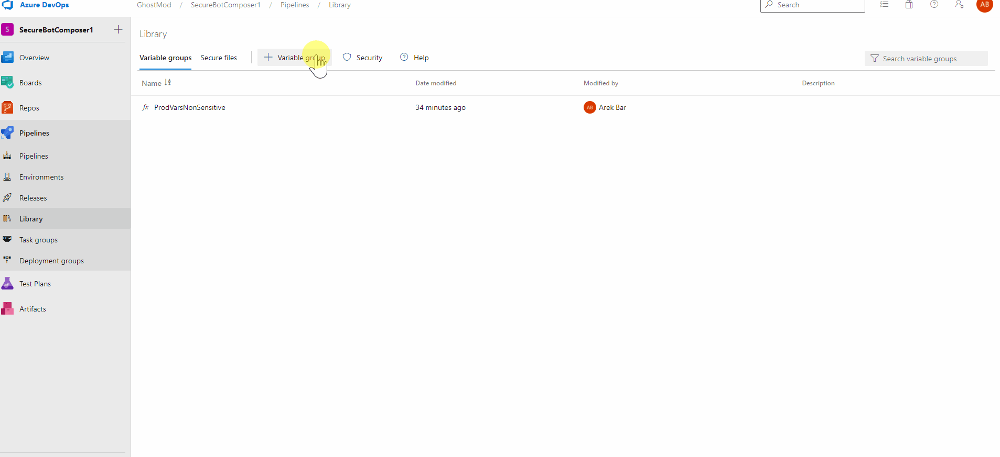
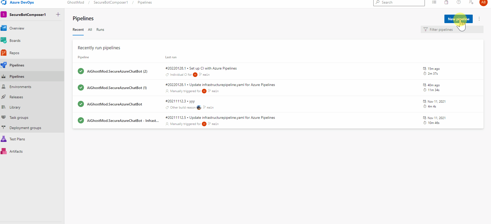
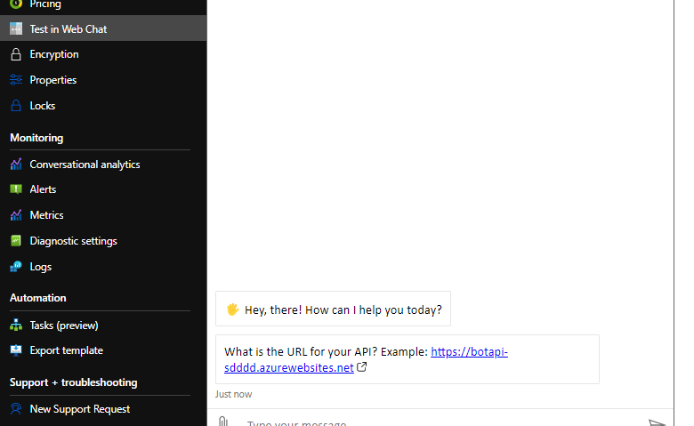
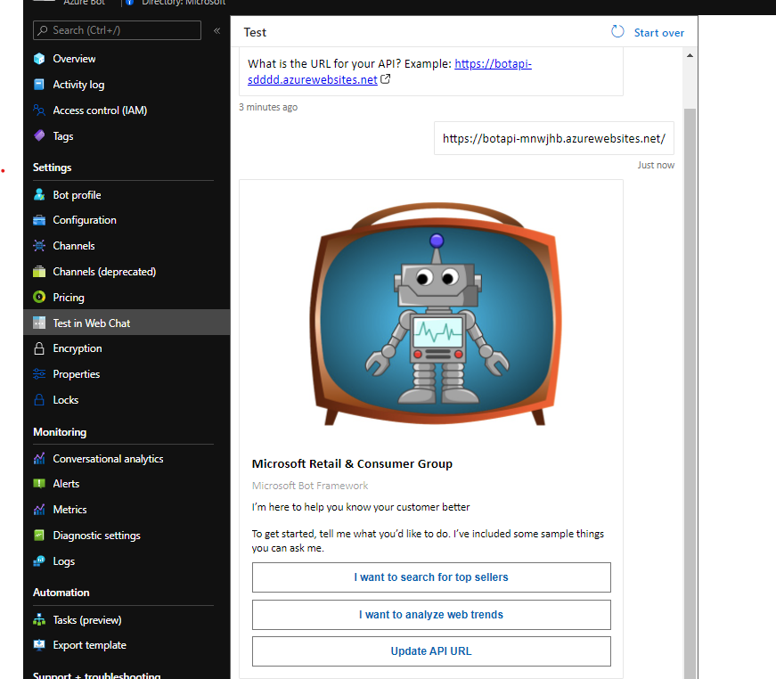

<!-- ABOUT THE PROJECT -->
# About This Module

The purpose of this module is to create a CICD Pipeline that will manage the Bot Code

## Create a Secure Variable Library connection to Key Vault

The infrastructure script is configured to store all output variables inside the previously configured KeyVault. Before our Bot code pipeline can access the variables we need to create another variable group (BotProdVarsSecure) and link it with KeyVault

* Pipelines > Library > + Variable Group
  * Name the Variable Group
  * Select "Link secretes from an Azure key vault as variables
  * Select the service connection
  * Select the key vault name we created 
  * Click Add
    * Select All Variables
    * Press Ok
  * Save

 

  

## Create CICD Pipeline and Deploy Bot Code

* Pipelines > New Pipeline > GitHub > Select Repo > Existing Azure Pipelines YAML file
  * Branch: main
  * Path: /CICD/Bot/buildAndDeploy.yaml
* Continue > Run

 

  

## Test the Bot

Inside the Azure Portal, navigate to the Resource Group containing Bot resources and select the Azure Bot (named azurercgbot-yourpostfix)

Select Test in Web Chat from the left menu. It could take a few seconds the first time for the following message to appear:

 

  

Enter in the previously created Function URL and press Enter. 

 

  

The bot should now be fully functional

[Return to Main ReadMe](../../README.md)