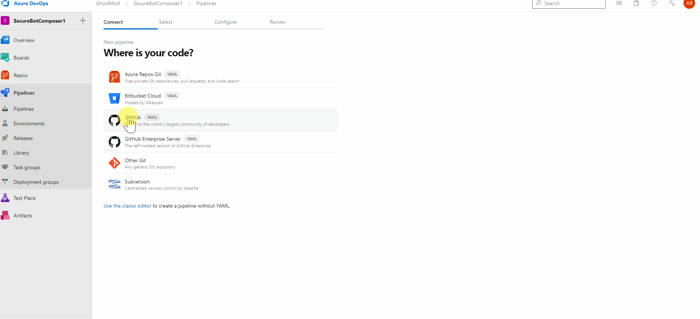

<!-- ABOUT THE PROJECT -->
# About This Module

The purpose of this module is to create the infrastructure that is going to host our Bot

## Create your Azure DevOps Pipeline

New Pipeline > GitHub > Select Your Repo > Existing Azure Pipelines YAML file > Branch: Main > Path: /infrastructure/infrastructurepipeline.yaml

Note that the existing pipeline specifies an agent pool as well as a variable group. These will need to be adjusted to fit your environment. 

For Variables, please reference [DevOps Setup](../../DevOps/Setup/SetupReadme.md)

For Private Agent, please reference [DevOps Private Agent Setup](../../DevOps/Setup/SetupPrivateAgentReadme.md) 

Please do note that a Private Agent MAY be required depending on the security restrictions applied to the web app. For example in a scenario where the web app hosting the bot has security rules applied that restrict it to internal network access only.

 

  

The script will take apporoximately 12 minutes to create/configure all required resources and settings

[Return to Main ReadMe](../../README.md)