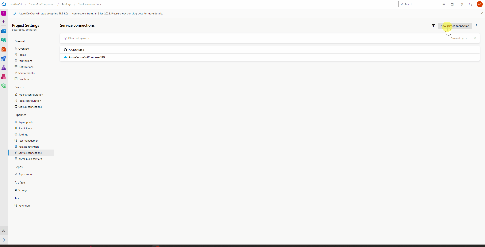
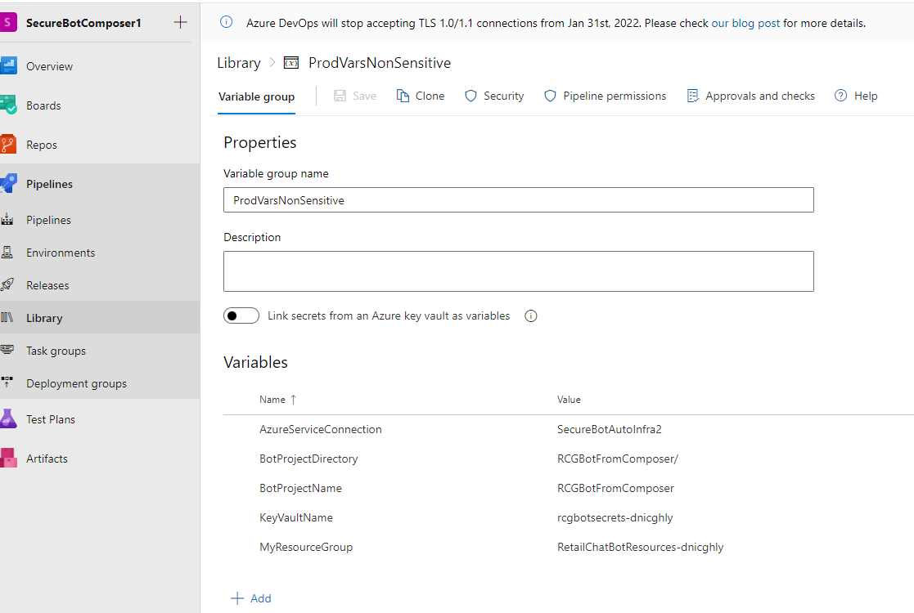

<!-- ABOUT THE PROJECT -->
# About This Module

The purpose of this module is to set up our CICD Pipeline for deploying Azure Bot created with Bot Framework Composer

## Prepare Your Azure DevOps Project

* Create DevOpsOrg
* Create DevOpsProject

### Set up Azure CLI

```shell

az login
az account list --output table
az account set --subscription <insert your sub name or ID>

```

### Create Resource Group

```shell
$Random = -join ((97..122) | Get-Random -Count 8 | % {[char]$_}) # Ganerating a 8 character string to aid naming uniqueness 
$Location = "westus" # Location of the Resources we will be creating
$MyResourceGroup = "RetailChatBotResources-$Random" # Name of the Resource Group

az group create -l $Location -n $MyResourceGroup
```
### Create Azure Dev Ops Service Connection

In Azure DevOps, Create a Service Connection specifying the resource group that we just created
<!-- PROJECT LOGO -->
<br />
<div align="left">
  <a href="../../ReadmeContent/ServiceConnection.gif">
    
  </a>
</div>

Fill in the details generated above and execute the following script to create a secure KeyVault and allow your DevOps service connection identity to access the vault.

```shell
$AzureDevOpsOrg = "<DevOpsOrgURL>" # Insert your dev ops organization example: https://dev.azure.com/ORGNAME
$AzureDevOpsProject = "<DevOpsProjectName>" # Insert your dev ops project example: SecureBotProject1
$AzureDevOpsServiceConnectionName = "<DevOpsServiceConnectionName>" # Insert name of the service connection: projectSettings > Service Connections > copy paste the service connection name here

 
$KeyVaultName="rcgbotsecrets-$Random"

$AppRegistrationAD = "retailchatbotreg-$Random" # App Registration Name
$AppRegistrationPassword= "123.456" + -join ((65..90) + (97..122) + (48..57) + 46| Get-Random -Count 25 | % {[char]$_}) #generates random password


az keyvault create --name $KeyVaultName --resource-group $myResourceGroup --location $Location
$DevOpsConnectionIdentity = $(az devops service-endpoint list --organization $AzureDevOpsOrg --project $AzureDevOpsProject --query "[?name=='$AzureDevOpsServiceConnectionName'].authorization.parameters.serviceprincipalid" --output tsv)
$ObjectID=$(az ad sp show --id $DevOpsConnectionIdentity --query objectId --output tsv)
az keyvault set-policy --name $KeyVaultName --object-id $ObjectID --secret-permissions set get list

az ad app create --display-name $AppRegistrationAD --password $AppRegistrationPassword --available-to-other-tenants
$AppRegistrationID=$(az ad app list --display-name $AppRegistrationAD --query "[].appId" --output tsv)

az keyvault secret set --vault-name $KeyVaultName --name "MicrosoftAppId" --value $AppRegistrationID
az keyvault secret set --vault-name $KeyVaultName --name "MicrosoftAppPassword" --value $AppRegistrationPassword
```

### Create a Library (Variables)

The Pipeline will expect a variable Library with the following name: ProdVarsNonSensitive
You can change this name, however the change will need to be reflected in the pipeline itself as well

Variable               | Value
---------              | ------
MyResourceGroup | ResourceGroupNameWeJustCreatede 
KeyVaultName                | KeyVaultNameWeJustCreated
AzureServiceConnection    | DevOpsServiceConnectionName
BotProjectDirectory         | BotComposerCode/
BotProjectName       | RCGBotFromComposer


<br />
<div align="left">
  <a href="../../ReadmeContent/NonSensitiveVariables.png">
    
  </a>
</div>

[Return to Main ReadMe](../../README.md)