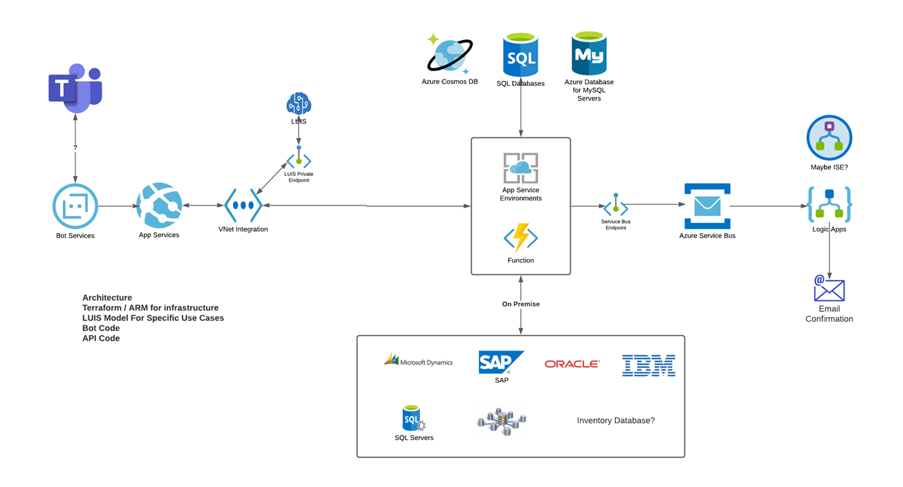

<!-- ABOUT THE PROJECT -->
# About The Project

The purpose of this asset is to provide a fast track for RCG customers who want to leverage the Azure Bot Framework. This asset is written in a way to facilitate learning about the Bot Framework Components and how they work together

## Contents

In this project, we will deploy:
* Infrastructure that will host the Azure Bot in a WebApp
* Fully functioning bot utilizing the bot framework
* API's powered by Azure Functions

Security being the central theme, once we have the bot up and running we will implement security features to the infrastructure.
* Vnet Integration
* Private Endpoints
* KeyVault
* Private DNS Zones
* NSG's

## Core Prerequisites

* Azure Subscription

* Azure DevOps Organization + Project 
    * https://dev.azure.com/

* Azure Bot Framework Composer
    * https://docs.microsoft.com/en-us/composer/install-composer?tabs=windows

## Installation

<!-- TABLE OF CONTENTS -->

  <ol>
    <li>
      <a href="/DevOps/Setup/SetupReadme.md">Azure DevOps Prep Work</a>
    </li>
    <li>
      <a href="/CICD/Infrastructure/InfraSetupReadme.md">Azure DevOps Build Infrastructure</a>
    </li>
    <li>
      <a href="/SampleFunctionAPI/ReadMeAPI.md">Azure DevOps Functions API</a>
    </li>
    <li>
      <a href="/CICD/Bot/BotCodeSetupReadme.md">Azure DevOps Bot Code</a>
    </li>
  </ol>

<!-- [Azure DevOps Prep Work](/DevOps/Setup/SetupReadme.md)

[Azure DevOps Build Infrastructure](/CICD/Infrastructure/InfraSetupReadme.md)

[Azure DevOps Functions API](/SampleFunctionAPI/ReadMeAPI.md)

[Azure DevOps Bot Code](/CICD/Bot/BotCodeSetupReadme.md) -->

## Securing the Bot After Deployment + Testing

  <ol>
    <li>
      <a href="/AddOns/Security/SecureInfra.md">Security Modules</a>
    </li>
  </ol>

<!-- [Security Modules](/CICD/Infrastructure/SecureInfra.md) -->

## Addons

<ol>
  <li>
    <a href="/AddOns/Speech/SpeechReadMe.md">Add Voice</a>
  </li>
</ol>

<ol>
  <li>
    <a href="/DevOps/Setup/SetupPrivateAgentReadme.md">DevOps Private Agent</a>
  </li>
</ol>

## Dev Ops Board Generator for Azure Retail Bot

<ol>
  <li>
    <a href="/DevOps/ImportBoard/">Sample DevOps Board</a>
  </li>
</ol>

<!-- [Add Speech](/CICD/Infrastructure/SpeechReadme.md) -->

## Retail Chat Bot Materials

* [PowerPoint Presentations](/BillOfMaterials/PowerPoint)
* [Sample Workshop Agenda](/BillOfMaterials/Workshop)
 

## Architecture

<!-- PROJECT LOGO -->
 

  

## Solution Components

* WebApp (Hosting the Bot Code)
  * Vnet integration
  * Security groups
  * Private DNS
  * Secure environmental variables
  * Application Insights

* Azure Bot
  * Sample conversation flows with LUIS
  * Bot interaction examples
  * Bot - API integration
  * Dynamic Variables
  * Conversation state stored in CosmosDB 

* CICD
  * Private agents
  * Secure variable lifecycle
  * Infrastructure
  * Bot composer code drag and drop functionality
  * LUIS model training

### Trademarks

Trademarks This project may contain trademarks or logos for projects, products, or services. Authorized use of Microsoft trademarks or logos is subject to and must follow Microsoft’s Trademark & Brand Guidelines. Use of Microsoft trademarks or logos in modified versions of this project must not cause confusion or imply Microsoft sponsorship. Any use of third-party trademarks or logos are subject to those third-party’s policies.