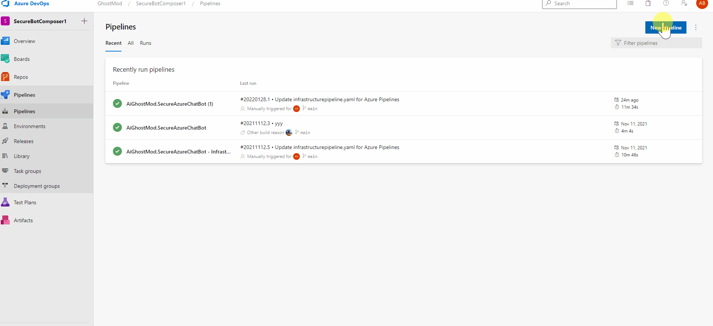

<!-- ABOUT THE PROJECT -->
# About This Module

The purpose of this module is to deploy an API that the Bot will communicate with to extract data. The API is a python azure function.

## Create CICD Pipeline

* Pipelines > New pipeline > GitHub > Select Bot Repository > Python Function App to Linux On Azure > Select Subscription > Select App Name (Created via Infrastructure Script) > Validate and configure > Save and Run

 

  

## Test API

Test the function API by navigating to the function URL /api/top_sellers?search_for=color

Example: https://botapi-postfix.azurewebsites.net/api/top_sellers?search_for=color

The return should be "{"color": {"blue": 9, "orange": 1, "green": 2}}"

